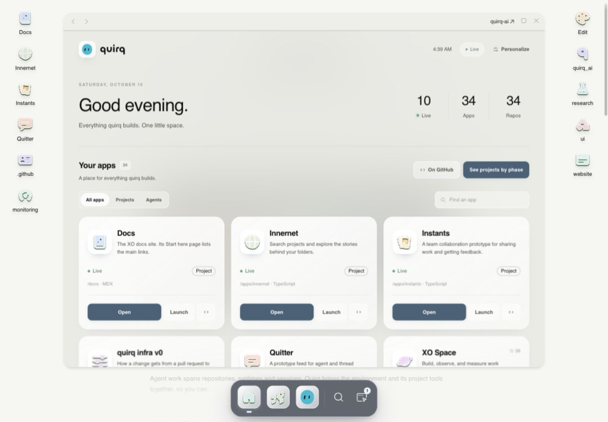
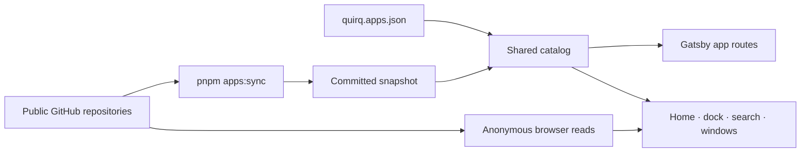

<p align="center">
  
</p>

# quirq home base

**Everything quirq builds. One little space.**

A desktop for the apps, experiments, tools, and open source projects in the [quirq GitHub organization](https://github.com/quirq-ai). Explore a repository, read its docs, follow a project's progress, or open an app in its own window.

<picture>
  <source media="(prefers-color-scheme: dark)" srcset="docs/images/home-base-dark.jpg" />
  
</picture>

<p align="center">
  <a href="#run-locally">Run locally</a> ·
  <a href="docs/quirq-app-mapping.md">Map an app</a> ·
  <a href="docs/development.md">Development guide</a> ·
  <a href="docs/repository-audit.md">Repository audit</a>
</p>

## A home for your apps

| Explore                                                              | Make it yours                                                                          | Keep work in view                                                                     |
| -------------------------------------------------------------------- | -------------------------------------------------------------------------------------- | ------------------------------------------------------------------------------------- |
| A live catalog of public repositories, with search and type filters. | Glass icons, light and dark themes, appearance settings, and a personal quirqy avatar. | Projects grouped by phase, with public build and canary state.                        |
| A file tree for each repository's Markdown docs.                     | Each app keeps its own name, color, route, and optional custom React view.             | Multiple windows, a floating dock, and expand, restore, minimize, and close controls. |

The desktop uses **Gatsby 4, React 18, and Tailwind CSS**, with a shared flex-based window system and layouts that respond to each window's width. The interface adapts desktop components and artwork from [PostHog/posthog.com](https://github.com/PostHog/posthog.com); its old marketing pages and service integrations have been removed.

Opening a repository shows public metadata and documentation. It does not install or run its code. App websites open in launch windows when their framing policy permits it; **Open in new tab** remains available when a website cannot be shown here.

## Run locally

Use **Node.js 24.x** and **pnpm 10.23.0**, as pinned in [`.nvmrc`](.nvmrc) and [`package.json`](package.json).

```sh
git clone https://github.com/quirq-ai/website.git
cd website
corepack enable
corepack prepare pnpm@10.23.0 --activate
pnpm install --frozen-lockfile
pnpm start
```

Open [localhost:8001](http://localhost:8001). The development server binds to `127.0.0.1`; stop it with `Ctrl+C`.

The committed snapshots are enough to start and build the site. No GitHub token, CMS account, or environment file is required.

## From GitHub to the desktop



**Built pages** use [`src/data/quirq-repositories.json`](src/data/quirq-repositories.json), mapped by [`quirq.apps.json`](quirq.apps.json). Builds validate this saved data and do not fetch GitHub.

**The browser** refreshes the public repository list every five minutes while the tab is visible. Repository docs and the organization's desktop profile come from public GitHub files. New repositories can open through `/apps/*` before the next deployment. If GitHub is unavailable, the catalog keeps its last usable list.

Public, non-archived repositories and forks are included by default. This organization's mapping includes `.github` too. Visibility is an explicit catalog choice; private repository metadata never belongs in the snapshots.

## Give an app its own identity

Edit a repository entry in [`quirq.apps.json`](quirq.apps.json):

```json
{
    "xo-space": {
        "name": "XO Space",
        "path": "/xo-space",
        "icon": "planet",
        "color": "purple",
        "featured": true,
        "window": { "width": 1080, "height": 760 }
    }
}
```

Choose an icon, color, description, route, visibility, launch destination, or a custom template under `src/templates/`. Repository types come from the organization's `role` property on GitHub. Keep app choices in the mapping so Home, desktop icons, search, and routes agree.

The [app mapping guide](docs/quirq-app-mapping.md) covers every setting, live updates, documentation links, and launch-window framing rules. A destination's security headers decide whether it can be embedded; exact trusted quirq.dev origins can be configured through `frameOrigins`.

To refresh the built catalog:

```sh
pnpm apps:sync
pnpm apps:check
```

Review and commit the generated snapshot. Restart Gatsby after changing routes, then rebuild and deploy to refresh server-rendered pages. After hiding a repository, run `pnpm apps:sync` or the offline `pnpm apps:prune` to remove its README from the bundled snapshot.

## Follow projects from idea to use

[`/projects`](src/pages/projects.tsx) groups repositories using [`quirq.projects.json`](quirq.projects.json). Phases come from repository evidence:

| Thought            | Prototype  | Built         | Shipping                                               | Project                                                  |
| ------------------ | ---------- | ------------- | ------------------------------------------------------ | -------------------------------------------------------- |
| Notes or a README. | Real code. | Code with CI. | Built and onboarded to qq, deployed, or in the canary. | At least 10 stars or 5 people committing, checked first. |

`pnpm projects:sync` refreshes the committed phase snapshot using public repository trees, star counts, and aggregate contributor counts. It stores no contributor names or emails. A manual phase override needs a `phaseReason`. Every public repository must belong to a group or be explicitly hidden.

The `/v0` app explains quirq infra and shows its public live state. See the [development guide](docs/development.md#quirq-infra) for workflow ownership.

## Work on the site

```sh
pnpm apps:check
pnpm projects:check
pnpm source:check
pnpm test
pnpm build
```

Preview the production output with `pnpm serve -H 127.0.0.1 -p 9000`. Before handing off UI changes, check wide and narrow windows in both themes, search, direct app routes, and the window lifecycle. Format only changed files.

| Area                             | Start here                                                                                                                     |
| -------------------------------- | ------------------------------------------------------------------------------------------------------------------------------ |
| Catalog and live data            | [`src/lib/quirqApps.ts`](src/lib/quirqApps.ts), [`src/lib/quirqLiveApps.ts`](src/lib/quirqLiveApps.ts)                         |
| Catalog validation and snapshots | [`scripts/lib/quirq-catalog.mjs`](scripts/lib/quirq-catalog.mjs), [`scripts/sync-quirq-apps.mjs`](scripts/sync-quirq-apps.mjs) |
| Desktop and navigation           | [`Desktop`](src/components/Desktop), [`Dock`](src/components/Dock/README.md), [`HomeBase`](src/components/HomeBase/README.md)  |
| Repository docs and launches     | [`QuirqApp`](src/components/QuirqApp/README.md), [`src/templates/quirq-launch.tsx`](src/templates/quirq-launch.tsx)            |
| Window state and controls        | [`src/context/App.tsx`](src/context/App.tsx), [`AppWindow`](src/components/AppWindow)                                          |
| Routes and hosting               | [`gatsby-node.ts`](gatsby-node.ts), [`gatsby-config.js`](gatsby-config.js), [`vercel.json`](vercel.json)                       |

Read [`AGENTS.md`](AGENTS.md) and the relevant component README before editing shared code. The [development guide](docs/development.md) covers commands, environment variables, deployment, and troubleshooting. The [repository audit](docs/repository-audit.md) records the cleanup, intentionally retained upstream material, and verification limits.

## Attribution and licensing

quirq's original additions retain the [Apache 2.0 license](LICENSE). Inherited desktop code and artwork retain the separate [upstream terms](LICENSE.posthog), including their website reuse restriction. Third-party vendored code keeps its own notices. The quirq name, marks, and approved brand art are reserved.

Read [LICENSING.md](LICENSING.md) before reusing or redistributing this repository. Adding quirq branding does not relicense inherited material.
